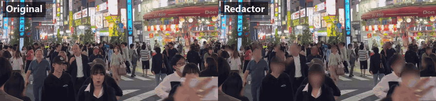
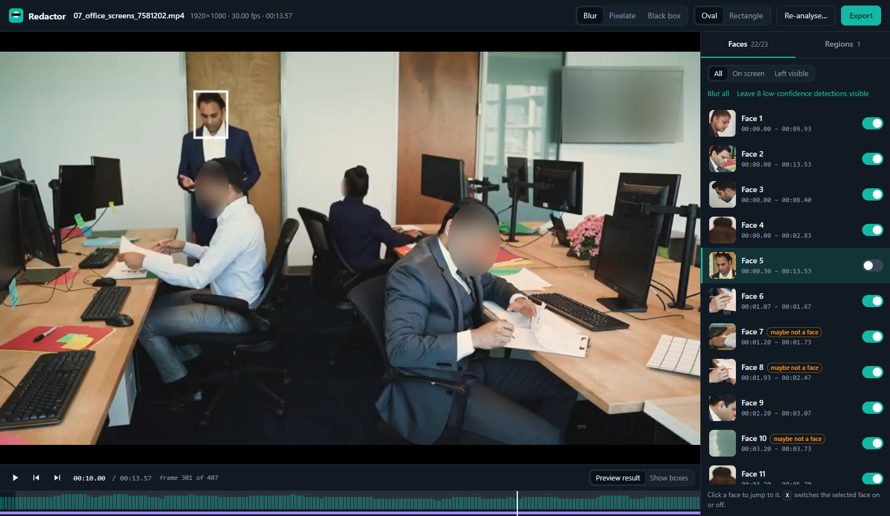
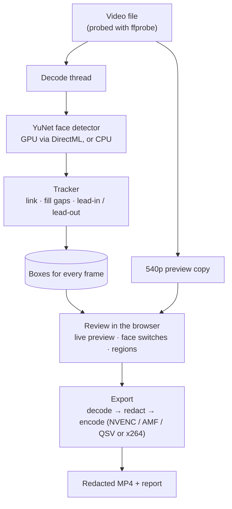

# Redactor

**Offline face redaction for video.** Redactor finds the faces in a video, lets you check and adjust
what it found, and exports a blurred copy with a report of what was hidden. Everything runs on your
own computer — nothing is uploaded.

[](https://github.com/GGMuttaky/redactor/actions/workflows/ci.yml)
[](LICENSE)


> **Free for non-commercial use.** The code is GPL-3.0, but the bundled face model was trained on a
> non-commercial dataset. See [Licence](#licence) before using Redactor for paid work.



<sub>Left: original. Right: Redactor's export with default settings and no manual edits.
Stock footage by Cheng on Pexels.</sub>

## Why

Footage of people who haven't consented — bystanders in a street interview, staff in an office tour,
the public in an event film — often has to be anonymised before it can be published. The usual
options are uploading sensitive footage to a cloud service, or masking faces by hand, frame by frame,
in an editor. Redactor does it locally — a short clip takes minutes — and shows you everything it found
before it writes anything.

## What it does

- **Finds faces on every frame** with the YuNet detector at up to 1920 px on the long side, including
  small, distant, masked and side-on faces in crowds ([how well](#how-well-it-works)).
- **Uses the graphics card** through DirectML and falls back to the CPU on its own. Tested with NVIDIA
  graphics (~50 frames/s at 1080p); AMD and Intel cards use the same path but are untested.
- **Tracks each face** through the shot, fills frames the detector missed, and keeps covering a face
  for a moment as it turns away or enters the frame.
- **Review before export**: live blur preview, every face listed with a thumbnail and a switch to leave
  it visible, and a timeline of where faces appear.
- **Hand-drawn regions** for number plates, screens or documents — place a box at two moments and it
  moves between them.
- **Blur, pixelate or black box**, oval or rectangular.
- **Export**: full resolution, all audio tracks, hardware encoder when available. Never overwrites the
  source or an earlier export; checks the frame count of what it wrote.
- **Report** (HTML + JSON): checksums of source and output, every face and region with its time range and
  whether it was hidden. It deliberately contains no face images.



<sub>The review screen. Face 5 is selected and switched off, so that person stays visible in the export;
everyone else is blurred, and a hand-drawn region hides the TV. Stock footage by RDNE Stock project on Pexels.</sub>

## Quick start (Windows)

You need **Windows 10 or 11**, **[Python 3.12 or newer](https://www.python.org/downloads/)** and
**FFmpeg 5.1 or newer** (`winget install Gyan.FFmpeg`).

```bat
git clone https://github.com/GGMuttaky/redactor.git
cd redactor\app
Redactor.bat
```

The first run sets up a private Python environment and installs OpenCV, NumPy and ONNX Runtime
(one-off download); after that it opens straight into your browser. Choose a video, wait for the
analysis, review, export. If setup fails with a "path too long" error, move the folder somewhere short
such as `C:\redactor`. More options: [`app/README.md`](app/README.md).

## How well it works

Measured on eight public test clips ([list](testclips/SOURCES.md): crowds, night, masks, profiles, a car
park, an office, a talking head), on one mid-range desktop PC with an NVIDIA graphics card. Speeds on other PCs will differ.
Method and raw results: [`research/`](research/).

| | |
|---|---|
| Dense night crowd (Tokyo, 320 frames) | 46 detections per frame vs 2.6 for the Apache-licensed MediaPipe detector; no clear miss found in the crowd on a full-resolution check frame |
| Hand-counted faces covered | car park 12 / 12, office 16 / 16 (4 frames each) |
| Finding faces | ~50 frames/s at 1080p and ~108 at 720p on the GPU; 8–20 on the CPU |
| Whole analysis, 29 s 720p street clip | 14 s |
| Export, 1080p, office clip | 96 frames/s with NVENC, 23 with x264 — same quality and file size (PSNR/SSIM checked) |
| GPU vs CPU detections | 99.76–100 % matched (box overlap IoU ≥ 0.8) on 5 clips |

These are small samples. They show the detector works on hard footage, not that it never misses:
**always watch the export before publishing it.**

## How it works



The app is a small local web server (Python standard library) serving a plain-JavaScript review page.
It listens on `127.0.0.1` only. Every request must carry a per-session token and this server's exact
`Host`, and the page forbids framing and outside scripts, so other websites open in the same browser
cannot drive it.

### Engineering notes

A few problems that shaped the design, each measured before and after (details in [`research/`](research/)):

- **Choosing the detector.** MediaPipe has the cleanest licence but covered only ~25 % of faces in a
  crowd and almost none behind masks, even with tiling. YuNet made up to 18× more detections per frame.
- **GPU without OpenCV's help.** OpenCV's pip build can't run YuNet on the GPU, so its output decoding
  was re-implemented on ONNX Runtime + DirectML and checked against OpenCV: 99.76–100 % of detections match.
- **Copying frames to the card.** Sending each frame to the graphics card cost more than the detection
  itself on the test PC. The ONNX graph was wrapped to accept raw 8-bit frames: a quarter of the data per frame.
- **DirectML shape specialisation.** Running a small warm-up image first made every real frame 3.5×
  slower; sessions are now built for each video's exact frame size.
- **Tracking crowds.** Pair-by-pair matching in Python became slower than detection on a 46-faces-per-frame
  crowd; the vectorised version gives identical tracks on all 8 clips, 25× faster.
- **Export.** Blurring at full resolution dominated export time; blurring a down-sampled grid gives the
  same look ~20× cheaper (71 → 3.4 ms per frame). NVENC was tuned against a lossless reference to match
  x264 CRF 18.

## Limitations

- Detection is not perfect: faces turned fully away, heavily occluded, very motion-blurred or under ~10 px
  can be missed. **Always watch the export before publishing.**
- Number plates, screens and documents are not detected automatically — use regions.
- Variable-frame-rate sources are exported at their average frame rate; 10-bit/HDR is exported as 8-bit SDR;
  odd frame sizes (e.g. 321×241) get one black line added, because H.264 needs even sizes.
- Windows only so far. AMD/Intel graphics and their encoders are implemented but untested on real hardware.

## Privacy

Nothing leaves your computer. While you work on a video, Redactor keeps a preview copy and a thumbnail
of each face — **unblurred** — in `%LOCALAPPDATA%\Redactor\projects\`. Delete a project from the start
screen when you are done with it; exports and reports beside your video are not affected.

## Licence

- **Code:** GNU General Public License v3.0 or later — see [`LICENSE`](LICENSE).
- **Face model — non-commercial use.** The YuNet model files are MIT-licensed, but the model was trained
  on the WIDER FACE dataset (CC BY-NC-ND 4.0). Until it is replaced by a model trained on commercially
  usable data, treat Redactor as **free for non-commercial use**. See
  [`THIRD_PARTY_NOTICES.md`](THIRD_PARTY_NOTICES.md) and [`docs/LICENSING.md`](docs/LICENSING.md).

## Contributing

Bug reports and test cases where a face is missed are welcome — see [`CONTRIBUTING.md`](CONTRIBUTING.md)
for setup, tests (`pytest`, plus an end-to-end check on real clips) and what to include in a report.
Security problems: [`SECURITY.md`](SECURITY.md). Changes: [`CHANGELOG.md`](CHANGELOG.md).

## Repository layout

```
app/          the application (start here: app/README.md)
  redactor/   engine, local server, web UI
  models/     face models (see models/NOTICE.md)
  tools/      builds the GPU model from OpenCV's release
  tests/      unit and pipeline tests (pytest) and an end-to-end check on real clips
research/     detector comparisons, benchmarks and results behind the design (RESULTS_r1–r3.md)
testclips/    list of the public test clips (clips themselves not included)
docs/         demo media, licensing plan
```

## Credits

[YuNet](https://github.com/opencv/opencv_zoo/tree/main/models/face_detection_yunet) by Shiqi Yu (OpenCV
zoo) · [OpenCV](https://opencv.org/) · [ONNX Runtime](https://onnxruntime.ai/) · [FFmpeg](https://ffmpeg.org/) ·
test footage from [Pexels](https://www.pexels.com/) contributors listed in [`testclips/SOURCES.md`](testclips/SOURCES.md).
